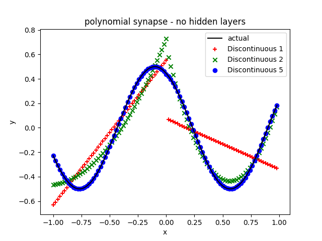

# Piecewise Polynomial Layers for Tensorflow
Tensorflow layers using piecewise Chebyshev polynomials.  Earlier I wrote a c++ code that explored higher 
order weights in the synapse of of a standard neural network [here](https://www.researchgate.net/publication/276923198_Discontinuous_Piecewise_Polynomial_Neural_Networks) .  This is an effort to reproduce that work in Tensorflow.  This is a work in progress and ultimately the layers will need to be done in c++ to get
reasonable performance.

The idea is extremely simple - instead of a single weight at the synapse, use n-weights.  The n-weights describe a piecewise polynomial and each of the n-weights can be updated independently.  A Chebyshev polynomial and gauss lobatto points are used to minimize oscillations of the polynomial.

# Installation

```bash
pip install snovalleyai-piecewise-polynomial-layers
```

# Use

```python
import tensorflow as tf
import snovalleyai_piecewise_polynomial_layers.PolynomialLayers as poly
mnist = tf.keras.datasets.mnist

(x_train, y_train),(x_test, y_test) = mnist.load_data()
x_train, x_test = (x_train / 128.0-1.0), (x_test / 128.0-1.0)

units = 16

basis = poly.b5

model = tf.keras.models.Sequential([
  tf.keras.layers.Flatten(input_shape=(28, 28)),
  poly.Polynomial(units, 28*28, basis=basis),
  tf.keras.layers.LayerNormalization(),
  poly.Polynomial(units, units, basis=basis),
  tf.keras.layers.LayerNormalization(),
  poly.Polynomial(units, units, basis=basis),
  tf.keras.layers.LayerNormalization(),
  tf.keras.layers.Dense(10, activation='softmax')
])

model.compile(optimizer='adam',
              loss='sparse_categorical_crossentropy',
              metrics=['accuracy'])

model.fit(x_train, y_train, epochs=5, batch_size=2)
model.evaluate(x_test, y_test)
```

# Example

Here is the result for fitting a sin wave with no hidden layers.  There is only one input neuron and one output neuron and no neuronal non-linearity.  A 5th order polynomial is used in the synapse - there are 6 weights and only one synapse in the network.


# Example 2

Same problem, but comparison between 1st 3rd and 5th order piecewise discontinuous polynomial synapses.



# Example 3

Same problem, but comparison between 1st 3rd and 5th order piecewise continuous polynomial synapses.


# Available polynomial orders

```python
import snovalleyai_piecewise_polynomial_layers.PolynomialLayers as poly

#Non piecewise polynomials
poly.b1 #linear chebyshev
poly.b2 #quadratic chebyshev
poly.b3 #3rd order chebyshev
boly.b4 #4th order chebyshev
poly.b5 #5th order chebyshev

## Discontinous piecewise polynomials, 2 pieces
poly.b1D #linear chebyshev (discontinuous pair)
poly.b2D #quadratic chebyshev (discontinuous pair)
poly.b5D #5th order chebyshev (discontinuous pair)

## Continuous piecewise polynomials, 2 pieces
poly.b1D #linear chebyshev (continuous pair)
poly.b2D #quadratic chebyshev (continuous pair)
poly.b5D #5th order chebyshev (continuous pair)
```
The layer inside tensorflow is then called (see mnist example above)
```
poly.Polynomial(units, input, basis=basis),
```
where units is the number of units and input is the size of the input


# Notes
You can achieve high accuracy with very small networks without a non-linearity at the neuron.
